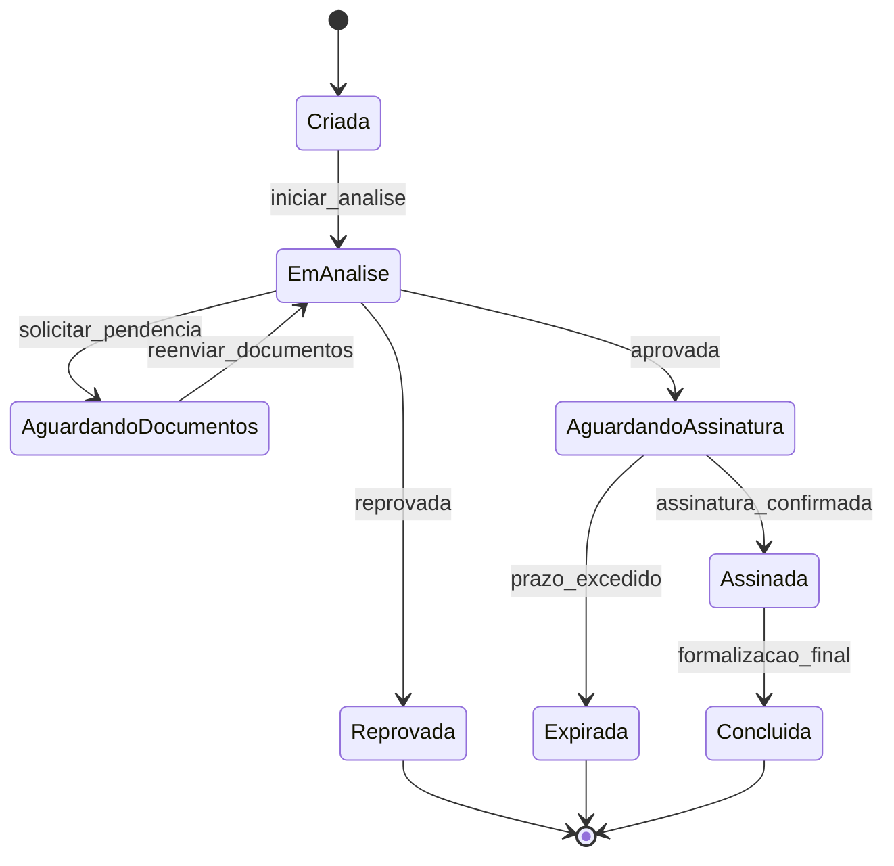

# Desafio Técnico Neo Crédito

Aplicação frontend em Next.js para simular o fluxo de validação e assinatura eletrônica de propostas de crédito.

<p align="center">
	<b>Frontend challenge para fluxo de propostas de crédito com validação, assinatura e feedback global de estados</b><br/>
	
	
	
	
	
	
	
</p>

## Objetivo

Este repositório foi construído como desafio técnico, com foco em:

- organização de arquitetura frontend;
- modelagem de fluxo de negócio orientado a estados;
- testabilidade e confiabilidade dos fluxos principais;
- legibilidade e evolução contínua do código.

## Decisões Técnicas

### Atomic Design

O projeto organiza componentes por níveis de composição para facilitar reuso e manutenção:

- atoms: blocos básicos visuais e de interação;
- molecules: combinações pequenas e reutilizáveis;
- organisms: seções maiores da interface, com regra de apresentação.

Benefícios práticos:

- reduz duplicação de UI;
- deixa clara a responsabilidade de cada camada;
- melhora a previsibilidade dos testes por nível de componente.

### Styled Components

Styled Components foi adotado para co-localizar estilo e componente, mantendo encapsulamento visual e tema centralizado.

Benefícios práticos:

- estilos com escopo local;
- composição dinâmica de estilos via props;
- manutenção mais simples de tokens e consistência visual.

### MSW (Mock Service Worker)

MSW foi escolhido para simular API de forma realista, tanto no desenvolvimento quanto nos testes.

Benefícios práticos:

- desacoplamento entre frontend e backend real;
- testes de integração mais próximos do comportamento de rede;
- controle claro de cenários de sucesso, loading, erro e retry.

## Diagrama de Máquina de Estados (Status da Proposta)



## Notas de Desenvolvimento

As anotações de apoio técnico ficam em [src/dev-notes/](src/dev-notes/) e são ignoradas no versionamento Git, junto com [dev-notes/](dev-notes/).

Essas notas costumam reunir:

- contexto de etapas e decisões;
- critérios de implementação;
- observações sobre fluxos e cobertura de testes.

## Instalação e Execução

### 1. Pré-requisitos

- Node.js 20+;
- npm 10+.

### 2. Instalar dependências

```bash
npm install
```

### 3. Rodar em desenvolvimento

```bash
npm run dev
```

Aplicação disponível em http://localhost:3000.

### 4. Validar qualidade

Checagem de tipos:

```bash
npx tsc --noEmit
```

Lint:

```bash
npm run lint
```

Testes:

```bash
npm test -- --runInBand
```

### 5. Build de produção

```bash
npm run build
npm start
```

## Escopo

Projeto com finalidade avaliativa. Não representa integralmente requisitos de produção, como segurança, compliance, observabilidade e operação em escala.
