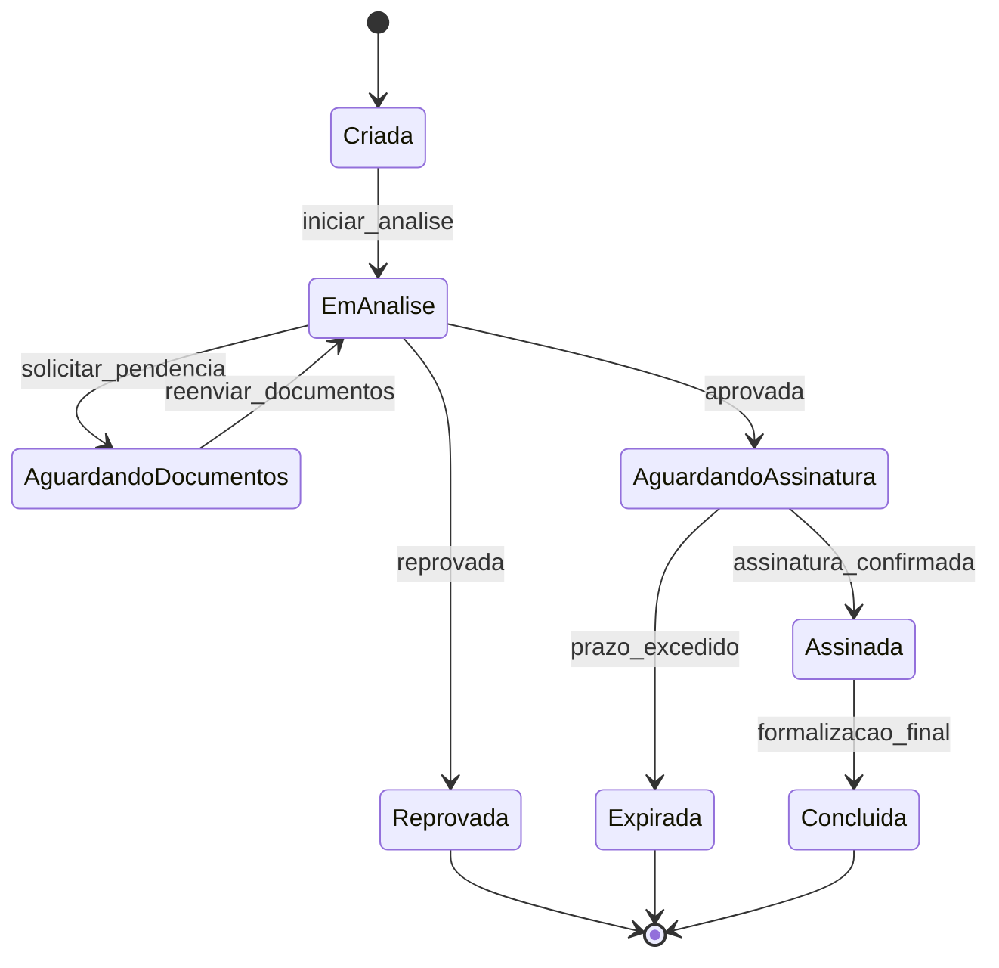

# [Neo Crédito](https://neocredito.com.br/) Challenge

<a href="https://neo-credito-challenge.vercel.app/painel" target="_blank">
	
</a>

## Visão Geral

<p align="center">
	<b>Para testar a aplicação, basta acessar o frontend publicado em:<br/>
	<a href="https://neo-credito-challenge.vercel.app/painel" target="_blank">https://neo-credito-challenge.vercel.app/painel</a></b>
</p>

Este repositório contém o desafio técnico frontend da Neo Crédito, focado no fluxo de validação operacional de propostas, análise de dossiê e acompanhamento de status até a assinatura eletrônica.

<p align="center">
	<b>Stack principal do projeto</b><br/>
	
	
	
	
	
	
	
</p>

## Objetivo

Este repositório foi construído como desafio técnico, com foco em:

- organização de arquitetura frontend;
- modelagem de fluxo de negócio orientado a estados;
- testabilidade e confiabilidade dos fluxos principais;
- legibilidade e evolução contínua do código.

## Modelo UML do Problema: Máquina de Estados da Proposta

Este diagrama UML (state machine) representa o problema central que o projeto buscou resolver: a evolução controlada dos status da proposta ao longo da operação, da validação até a assinatura eletrônica.



## Decisões Técnicas

Esta seção resume, em ordem cronológica, o que foi construído, por que cada escolha foi feita e como foi implementada tecnicamente.

### 1) Fundação da aplicação

Primeiro, construí uma base técnica estável para reduzir retrabalho nas etapas seguintes. A aplicação foi estruturada com Next.js + TypeScript e organização modular em `src`, enquanto o design system inicial foi montado com Styled Components (tema, estilos globais e componentes base). Em paralelo, modelei os tipos de domínio da proposta e usei MSW para simular a API desde o início. O objetivo técnico aqui foi garantir consistência entre contrato de dados, interface e regras de negócio antes de escalar funcionalidades.

### 2) Entrega do fluxo principal de operação

Com a base pronta, implementei o caminho principal de uso: layout operacional, listagem de propostas, filtros por busca/status e ordenação por recência. A separação entre apresentação e lógica foi feita com componentes reutilizáveis e hook dedicado (`useProposals`), permitindo controlar loading, erro, retry, refresh manual e atualização automática. Essa abordagem foi escolhida para manter a experiência rápida para o operador e, ao mesmo tempo, deixar o código preparado para evoluir sem acoplamento excessivo.

### 3) Profundidade de análise e contexto decisório

Na etapa seguinte, foquei em enriquecer a decisão operacional dentro da tela de validação: drawer de detalhes, visualização de dossiê, dados de contexto (CPF, IP, geolocalização aproximada), evidências com zoom e ações de aprovação/reprovação. Também implementei a solicitação de novo documento com validação de formulário, mudança de status e persistência no estado mockado. O motivo técnico foi tornar o frontend aderente ao fluxo real da operação, em que a decisão depende de contexto completo e rastreável, não apenas de uma listagem simples.

### 4) Confiabilidade por testes e previsibilidade de comportamento

Depois de consolidar as funcionalidades, priorizei estabilidade. Foram adicionados testes unitários e de integração com Jest + Testing Library cobrindo filtros, estados de loading/erro, regras de habilitação por status e fluxos críticos da validação detalhada (aprovar, reprovar e solicitar documento). Essa camada de testes foi essencial para proteger comportamento de ponta a ponta e permitir melhorias contínuas com menor risco de regressão.

### 5) Acabamento operacional, acessibilidade e performance percebida

Na fase final, refinei aspectos que impactam uso diário: skeletons e tela de carregamento, responsividade do layout, acessibilidade de modais (controle de foco, fechamento por Escape e retorno de foco) e uso de `next/image` nas mídias da validação. Também mantive feedback claro ao usuário com toasts e mensagens de erro/retry. Tecnicamente, essas escolhas foram feitas para melhorar fluidez operacional, reduzir atrito de navegação e elevar a qualidade percebida sem comprometer a simplicidade da arquitetura.

## Instalação e Execução

### 1. Pré-requisitos

- Node.js 20+;
- npm 10+.

### 2. Instalar dependências

```bash
npm install
```

### 3. Rodar em desenvolvimento

```bash
npm run dev
```

Aplicação disponível em http://localhost:3000.

### 4. Validar qualidade

Checagem de tipos:

```bash
npx tsc --noEmit
```

Lint:

```bash
npm run lint
```

Testes:

```bash
npm test -- --runInBand
```

### 5. Build de produção

```bash
npm run build
npm start
```

## O que faria com mais tempo

- **Motor antifraude documental e comportamental** — integrar validação de documentos com sinais de risco transacional para reduzir fraude sem degradar conversão.
- **Trilha de auditoria com valor jurídico** — registrar cadeia de evidências da assinatura (eventos, origem, integridade e temporalidade) para suportar auditoria e contestação.
- **Orquestração operacional multicanal para CORBAN** — implementar priorização por SLA, alçadas e distribuição inteligente para ganho de escala e governança.
- **Camada de compliance e privacidade by design** — aplicar políticas de consentimento, retenção e acesso a dados sensíveis alinhadas a requisitos regulatórios.

## Escopo

Projeto com finalidade avaliativa. Não representa integralmente requisitos de produção, como segurança, compliance, observabilidade e operação em escala.
