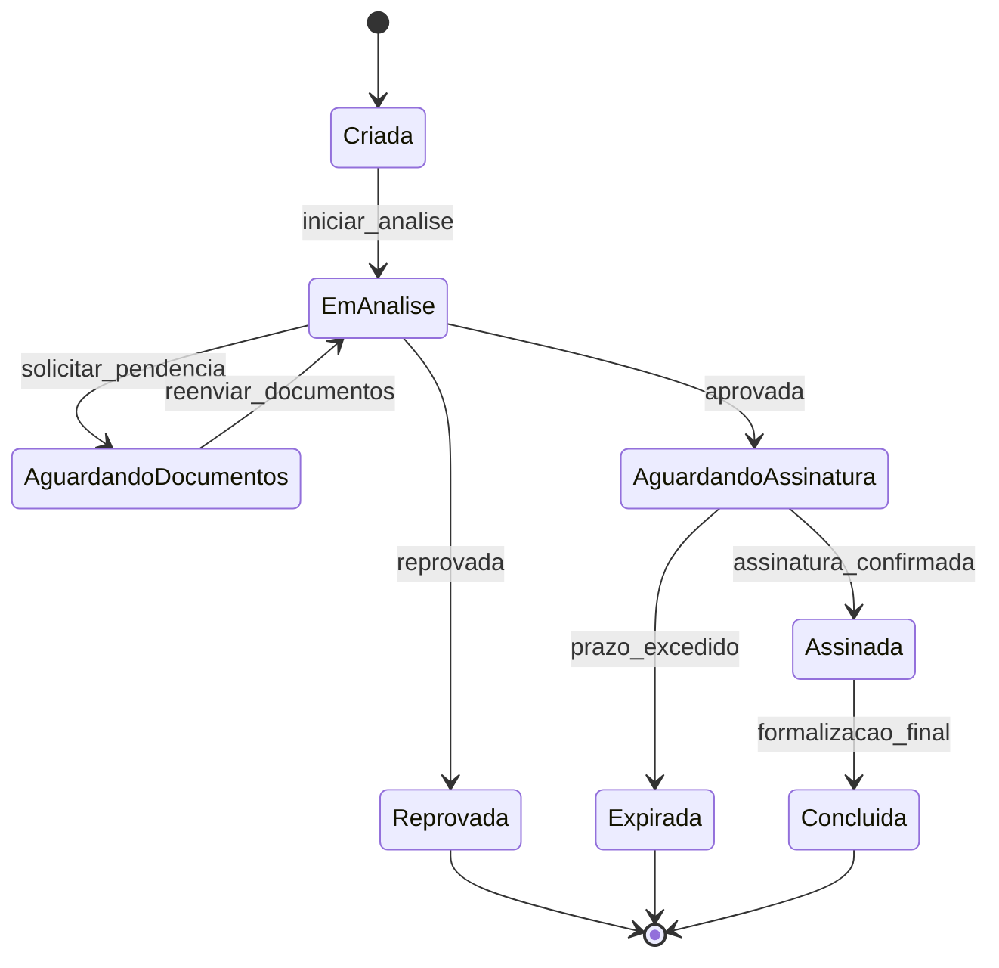

# Desafio Técnico Neo Crédito

Desafio técnico desenvolvido para o processo seletivo da Neo Crédito, com foco na modelagem de um fluxo de Assinatura Eletrônica para propostas de crédito.

## Aviso Importante

Este repositório não representa um produto corporativo final, nem uma solução real completa e robusta de mercado.

Trata-se de um desafio técnico para vaga de emprego, criado para demonstrar capacidade de:

- Arquitetura frontend
- Organização de código
- Qualidade técnica
- Modelagem de fluxo de negócio
- Boas práticas de testes

## Introdução

O sistema de Assinatura Eletrônica tem como objetivo garantir segurança jurídica, rastreabilidade e agilidade no ciclo de formalização de propostas. Em um cenário de crédito, a assinatura digital reduz fricções operacionais, acelera a tomada de decisão e melhora a experiência do cliente ao eliminar etapas presenciais e documentos físicos.

Neste desafio, a proposta é demonstrar como um frontend pode orquestrar estados, interfaces e validações de forma clara e escalável, sem a pretensão de cobrir todas as regras de produção de uma operação financeira real.

## Tecnologias Utilizadas Neste Desafio

- React/Next.js
- TypeScript
- Styled Components
- MSW (Mock Service Worker)
- Jest

Observação: a stack deste desafio foi definida pelo escopo técnico da avaliação e não replica obrigatoriamente todos os itens da vaga em produção.

## Diagrama de Máquina de Estados (Status da Proposta)

## Sobre a Neo Crédito (Contexto Institucional)

A Neo Crédito apresenta o crédito como ferramenta de transformação, com foco em clareza, respeito e empatia no atendimento a servidores públicos em todo o Brasil.

Pontos institucionais destacados:

- Missão: transformar vidas por meio de soluções de crédito com responsabilidade, empatia e ética
- Visão: revolucionar o mercado de crédito no Brasil, com soluções inovadoras e acessíveis
- Valores: respeito pela pessoa, atendimento, excelência e integridade

## Benefícios e Ambiente (Resumo da Descrição da Vaga)

- Ambiente acolhedor e colaborativo
- Caju Benefícios
- Plano de saúde Amil
- Plano odontológico Uniodonto
- Wellhub
- Atendimento psicológico e nutricional (Conexa Saúde)
- Convênio farmácia
- Ginástica laboral
- Eventos internos e ações de reconhecimento
- Parcerias com instituições de ensino
- Máquina self-service (cafés, chás e snacks)
- Rentbrella

## Escopo e Limitações do Desafio

- Este material possui finalidade avaliativa de processo seletivo.
- Não substitui desenho completo de arquitetura de produção.
- Não contempla todos os requisitos de segurança, compliance e operação de uma fintech real.
- Prioriza clareza técnica, legibilidade e capacidade de evolução da solução.
